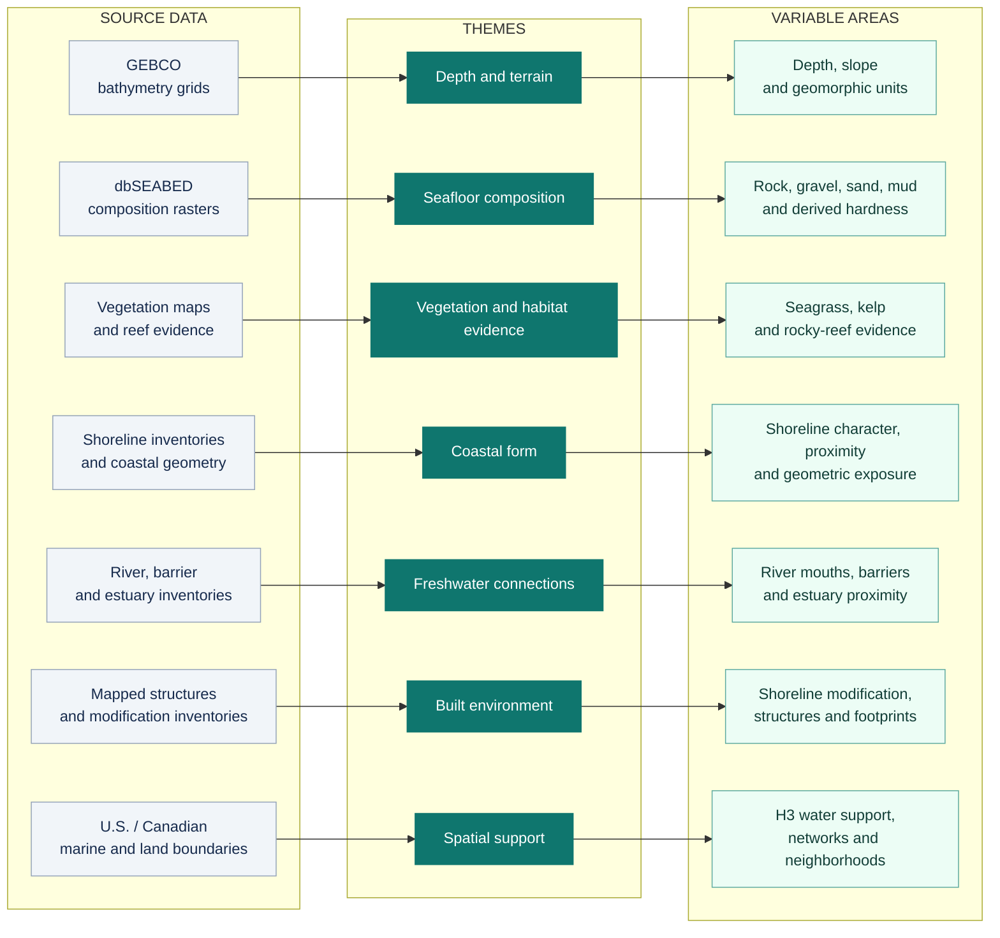

<div align="center">

# Seascape Toolkit

**The shape, composition, and connectivity of the marine environment.**

Depth and terrain · Seafloor composition · Marine vegetation · Coastal form

[Explore the themes](#what-seascape-describes) · [Get a first result](#install-and-get-a-first-result) · [Read the docs](docs/README.md)

</div>

---

Seascape turns source datasets into spatial products describing the physical marine environment.
Use it to work with **depth, seafloor composition, mapped vegetation, coastal geometry, and freshwater
connections**, together with the spatial support and source evidence needed to interpret them.

Built for GIS users, researchers, and downstream applications. Independently installable; no
OrcaCast or sibling-toolkit checkout is required.

| Package | Python / command | Core delivery |
| --- | --- | --- |
| `toolkit-seascape` | `seascape` | Spatial tables, source evidence, quality-control fields, and provenance |

> [!NOTE]
> **New here?** Start with the [offline demo](#install-and-get-a-first-result). It produces a
> small bathymetry table, a validation report, and two figures without source downloads or credentials.

## From sources to variables

**Source data → Thematic processing → Interpretable variable areas**



*Conceptual overview, not the execution dependency graph. Spatial support is a shared foundation;
several products combine inputs across these routes. Source availability and acquisition methods
vary by family. See the [stage inputs](docs/stage-inputs.md) for operational dependencies.*

## What Seascape describes

Seven themes organize the toolkit. The examples below describe product capabilities, not a promise
of complete survey coverage or availability at every location and resolution.

| Theme | What it describes | Representative variables and products |
| --- | --- | --- |
| **🌊 [Depth and terrain](src/seascape/seafloor_physiography/README.md)** | The depth and physical shape of the seafloor | Bathymetry, depth-band fractions, slope, terrain shape, and geomorphic units |
| **🪨 [Seafloor composition](src/seascape/benthic_substrate/README.md)** | Modeled sediment composition and derived hardness | Rock, gravel, sand, and mud composition; substrate classification; derived bottom-hardness index |
| **🌿 [Vegetation and habitat evidence](src/seascape/biogenic_habitat/README.md)** | Mapped or derived evidence of vegetation and habitat-forming structure | Seagrass, kelp, rocky-reef evidence, mapped bivalve-bed proxies, coverage and confidence states |
| **〰️ [Coastal form](src/seascape/coastal_configuration/README.md)** | How shorelines and waterbody geometry shape marine space | Shoreline character and proximity, directional exposure, enclosure, width, and constriction |
| **💧 [Freshwater connections](src/seascape/hydrologic_connectivity/README.md)** | Connections between rivers, estuaries, and marine waters | River-mouth locations, fluvial connectivity, mapped barriers, passage evidence, and estuary proximity |
| **⚓ [Built environment](src/seascape/anthropogenic/README.md)** | The mapped physical footprint of human-made features | Shoreline modification, overwater structures, dredging, disposal, artificial reefs, and aquaculture footprints |
| **🧭 [Spatial support](src/seascape/spatial_support/README.md)** | The geometry and water-network framework shared by products | Water polygons, H3 support, passable edges, terminal connectors, and bounded neighborhoods |

Exact field names, units, resolutions, and source notes live in the [product reference](docs/products.md)
and linked family guides. The checked-in catalog is reference metadata; an audited release records
what was actually materialized.

**Interpretation matters.** Derived hardness is not a direct acoustic measurement. Geometric exposure
is not modeled weather or waves. A mapped structure is not a measure of vessel traffic or observer
effort. Vegetation and reef products retain the distinction between mapped evidence and unavailable
coverage; deep coral/sponge evidence remains explicitly unavailable rather than inferred.

## What you get

| Layer | Delivered information |
| --- | --- |
| **Physical products** | Parquet/GeoParquet tables and supporting spatial artifacts. Canonical H3 products use R8 and, where implemented, R6. Not every product exists at both resolutions. |
| **Evidence and quality** | Product-specific coverage, source state, confidence, and quality-control fields. Unknown, unavailable, and observed-zero values remain distinct. |
| **Reproducible identity** | Source and artifact checksums, configuration and code identity, and manifests. Completed releases retain immutable generations addressable by release ID. |
| **Inspection and export** | Family-specific inspectors and a release-backed H3 metric matrix with namespaced fields and retained source metadata. |

For downstream work, use [product resolution](docs/API.md) rather than hard-coding mutable output
paths. The [metric-matrix exporter](docs/metric-matrix.md) combines released fields for inspection
and joins without silently filling nulls or substituting another resolution.

## Install and get a first result

Start with a **small synthetic example**, not a regional download. It calls the production
bathymetry pipeline and leaves its outputs available for inspection.

### Install in an isolated environment

Download and extract the [pinned source ZIP](https://github.com/MarineCast/toolkit-seascape/archive/9755f94f4ae50957f5c1af5316afb3e3cda26e54.zip).
Open a terminal in the extracted root containing `pyproject.toml` and `README.md`. A checkout of
[that revision](https://github.com/MarineCast/toolkit-seascape/tree/9755f94f4ae50957f5c1af5316afb3e3cda26e54)
also works.

Use Python 3.11 or 3.14 on a tested Linux/macOS environment; see the
[platform coverage](docs/environments/README.md#tested-platforms). This is a source installation,
not an assumed PyPI or tagged release. Installation requires access to declared dependencies.

<!-- BEGIN QUICKSTART install -->
```sh
SEASCAPE_ENV="$PWD/.venv"
python3 -m venv "$SEASCAPE_ENV"
. "$SEASCAPE_ENV/bin/activate"
python -m pip install 'pip>=26.2'
python -m pip install .
python -m pip check
```
<!-- END QUICKSTART install -->

### Run the offline demo

Leave the source directory and select a fresh workspace. The environment remains active;
`SEASCAPE_WORKSPACE` identifies where this example writes its files.

<!-- BEGIN QUICKSTART demo -->
```sh
cd "$(mktemp -d "${TMPDIR:-/tmp}/seascape-first-result.XXXXXX")"
export SEASCAPE_WORKSPACE="$PWD/seascape-workspace"
seascape --workspace "$SEASCAPE_WORKSPACE" demo
```
<!-- END QUICKSTART demo -->

The command prints:

```text
Synthetic software acceptance: PASS (not a regional release)
```

It also prints the exact paths to the **Parquet table, family manifest, JSON validation report,
and two PNG figures**. Outputs stay under `$SEASCAPE_WORKSPACE/.seascape/demo/` after the command
finishes. This example uses a temporary directory, so copy anything you need before system cleanup.
The [demo guide](docs/demo.md) explains persistent workspace selection and safe reruns.


*Synthetic input, real production transformation. A 48 × 48 fixture raster becomes positive-down
depth summaries on H3 R8 support. This figure is not a regional bathymetric survey.*

<details>
<summary><strong>What the demonstration checks</strong></summary>

The output has one unique `H3_INDEX` per resolution-8 cell. The fixture includes controls for
known values, sign conversion, nonempty support, missingness, and truthful synthetic provenance.

| Synthetic control | Expected interpretation |
| --- | --- |
| Constant-depth patch | Mean depth is 5 m; zero spread is a valid observed statistic. |
| Interior gradient | Mean depth is `5680/47` m, approximately 120.8511 m, from 18 contributing pixels. |
| Nodata or outside coverage | Null values mean unavailable, not measured zero. |
| Exact sea level | Excluded by the existing marine mask, not reported as measured zero depth. |

See [fixture expectations and tolerances](docs/demo.md). A passing demo establishes software
acceptance for these inputs, not provider availability, regional accuracy, or a complete release.
Existing demo output is refused by default; review ownership before using `--overwrite`.

</details>

## Choose your route

| Your goal | Start here | Outcome |
| --- | --- | --- |
| **Try the toolkit** | [Offline demo](docs/demo.md) or [explanatory notebook](notebooks/README.md) | A small synthetic product with inspectable values, provenance, and validation results. |
| **Process real data** | [Bounded workflow](docs/WORKFLOWS.md#bounded-real-data-processing), [configuration](docs/CONFIGURATION.md), and [stage inputs](docs/stage-inputs.md) | A candidate built from reviewed inputs, with explicit inspection and publication decisions. See the [San Juan pilot](docs/pilots/san-juan.md) for bounded execution evidence and limits. |
| **Use existing products** | [Release-frozen consumer example](docs/API.md#freeze-and-read-a-release) and [matrix export](docs/metric-matrix.md) | Exact product/resolution lookup and checksum-verified paths from an existing audited release. |

Acquisition, processing, and release promotion are separate operations. Initializing a workspace
does not download datasets. Review the selected area's inputs and resources before executing
regional defaults; start with the documented bounded workflow rather than an unrestricted build.

## Scientific scope

> [!IMPORTANT]
> **Physical conditions and source evidence are not species occurrence or habitat suitability.**
> Seascape does not infer ecological absence from missing data or decide which variables belong
> in a predictive model. An audited software release is not blanket scientific certification.

Source datasets and regional releases are not bundled. Coverage, survey vintage, source resolution,
and uncertainty vary. Keep quality-control and evidence fields with the physical variables, and
read each family's source notes before interpretation or redistribution.

Publication uses POSIX locks; native Windows publication is outside the current supported scope.
See the [scientific and source contracts](docs/CONTRACTS.md) and
[validation progress](docs/roadmap/PROGRESS.md) for tested behavior and remaining limits.

## Reference and contribution

| Find | Read |
| --- | --- |
| Documentation overview | [Documentation index](docs/README.md) |
| Variables, families, and source notes | [Product reference](docs/products.md) |
| Setup, preparation, and command side effects | [Workflows](docs/WORKFLOWS.md) · [Configuration](docs/CONFIGURATION.md) |
| Stable consumer and producer interfaces | [Python API](docs/API.md) · [Metric matrix](docs/metric-matrix.md) |
| Architecture and contribution checks | [Architecture](docs/ARCHITECTURE.md) · [Development](docs/DEVELOPMENT.md) |
| Validation and release evidence | [Tested environments](docs/environments/README.md) · [Progress](docs/roadmap/PROGRESS.md) · [Release handoff](docs/release-candidate.md) |

Contributions should preserve scientific contracts and include focused tests and updated source
notes. Follow the [development guide](docs/DEVELOPMENT.md) before changing calculations, schemas,
configuration, or publication behavior.

---

**Software:** [Apache License 2.0](LICENSE). **Source data:** separate provider-specific rights and
attribution apply. Installing or running the toolkit does not grant redistribution rights to its inputs.

Part of [MarineCast](https://github.com/MarineCast).
