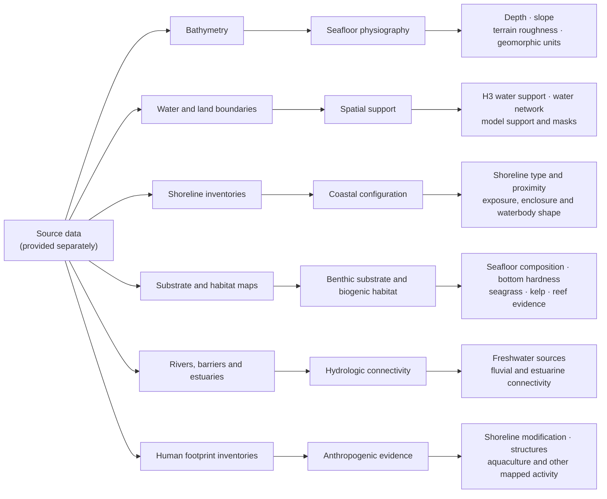
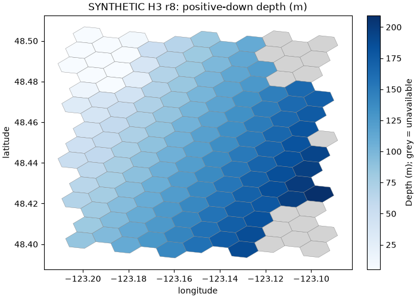

# Seascape Toolkit

Seascape is a Python toolkit for turning marine source data into documented, reusable spatial
products. It brings together water geometry, seafloor terrain, coastal form, hydrologic connections,
and mapped substrate and habitat evidence. GIS users and researchers can inspect those products;
downstream applications can consume them without adopting this repository's processing code.

The installable distribution is `toolkit-seascape`; its Python package and command are `seascape`.
It describes physical conditions and source evidence, not species occurrence or habitat preference.
Regional source datasets and audited releases are not bundled with the package. The toolkit code is
[Apache-2.0 licensed](LICENSE); source-data terms must be checked separately.

## What it produces



This is a map of product families, not build order. Spatial support supplies the shared water-cell
geometry used by the other families. What can be populated in a region depends on its available
sources; unmapped or unavailable is not the same as observed zero. See the [product index](docs/products.md)
for families, resolutions and fields, and the [scientific contracts](docs/CONTRACTS.md) for units,
coverage and provenance.

## Install and get a first result

Start with a small **synthetic bathymetry table**, validation report and two figures. The demo runs
offline after installation, with no credentials, source downloads, pytest, Jupyter or sibling
application checkout.

Download and extract the [source ZIP](https://github.com/MarineCast/toolkit-seascape/archive/9755f94f4ae50957f5c1af5316afb3e3cda26e54.zip)
for the [verified revision](https://github.com/MarineCast/toolkit-seascape/tree/9755f94f4ae50957f5c1af5316afb3e3cda26e54).
Open a terminal in the extracted root containing `pyproject.toml` and `README.md` (a checkout at
that revision also works). Use Python 3.11 or 3.14 on a tested Linux/macOS environment
([observed platform coverage](docs/environments/README.md#tested-platforms)).
This is a source installation; no PyPI publication or tagged software release is assumed.

<!-- BEGIN QUICKSTART install -->
```sh
SEASCAPE_ENV="$PWD/.venv"
python3 -m venv "$SEASCAPE_ENV"
. "$SEASCAPE_ENV/bin/activate"
python -m pip install 'pip>=26.2'
python -m pip install .
python -m pip check
```
<!-- END QUICKSTART install -->

Installation needs access to declared dependencies. Now leave the source directory and select
one fresh workspace. Keep `SEASCAPE_WORKSPACE` for later commands; the environment stays active.

<!-- BEGIN QUICKSTART demo -->
```sh
cd "$(mktemp -d "${TMPDIR:-/tmp}/seascape-first-result.XXXXXX")"
export SEASCAPE_WORKSPACE="$PWD/seascape-workspace"
seascape --workspace "$SEASCAPE_WORKSPACE" demo
```
<!-- END QUICKSTART demo -->

Success prints **Synthetic software acceptance: PASS (not a regional release)** and the exact
Parquet, family-manifest, JSON report and PNG paths. Artifacts stay under
`$SEASCAPE_WORKSPACE/.seascape/demo/`. Existing demo output is refused; see the
[demo guide](docs/demo.md) before using `--overwrite`.



*Generated by the production demo from its synthetic 48 × 48 raster. This illustration establishes
no regional accuracy, source availability or real water-network validation.*

The table has one row per H3 resolution-8 water cell. Depth is in meters, positive down; null
means unavailable, not measured zero. The [demo guide](docs/demo.md) explains the files, synthetic
controls, provenance and result checks. A PASS establishes software acceptance on those inputs,
not a complete regional release.

## Choose your route

| Route | Inputs and outcome | Guide |
| --- | --- | --- |
| Offline synthetic demo | Generated fixtures → Parquet/report/figures; no acquisition or release promotion | [Demo](docs/demo.md), [optional notebook](notebooks/README.md) |
| Bounded real-data processing | Reviewed sources, local inputs and configuration → isolated candidate; scientific validation still required | [Processing workflow](docs/WORKFLOWS.md#bounded-real-data-processing), [configuration](docs/CONFIGURATION.md), [stage inputs](docs/stage-inputs.md) |
| Consume an audited release | Existing schema-3 release → frozen identity, exact product/resolution and checksum-verified paths or matrix | [Consumer example](docs/API.md#freeze-and-read-a-release), [matrix export](docs/metric-matrix.md) |

Source datasets and regional releases are not shipped. The inherited regional defaults are not a
bounded acquisition recipe. Publication uses POSIX locks; native Windows is outside the tested
publication scope. Real-data acquisition/rebuild, downstream application integration and human
onboarding remain separate evidence gates.

## Explore the documentation

- [Documentation index](docs/README.md): all current guides and dated records.
- [Products and family guides](docs/products.md): what each family builds and which fields it records.
- [Workflow and configuration](docs/WORKFLOWS.md): plan a bounded build, inspect a candidate and
  understand publication effects; see also [configuration](docs/CONFIGURATION.md).
- [Scientific and source contracts](docs/CONTRACTS.md): support, units, missingness, provenance and
  validation limits.
- [Python API](docs/API.md): use producers or read a checksum-verified, retained release.
- [Development guide](docs/DEVELOPMENT.md): contribute, test and build the package.

The [progress record](docs/roadmap/PROGRESS.md) separates executed checks from remaining regional,
human and release-owner gates. Migration and review records are linked from the documentation index.
