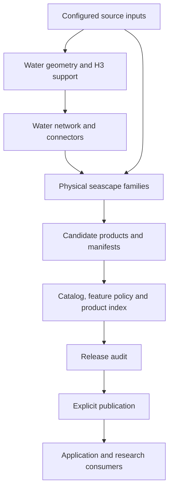

# Architecture

[Documentation index](README.md)

## Responsibilities

The toolkit owns source acquisition and normalization, physical seascape calculations, product
validation, inspection and release publication. Species-specific observation interpretation,
habitat preference, model fitting and forecasting belong to applications. Weather and oceanographic
processing are outside this package's workflow.

This diagram summarizes ownership. The actual dependency graph, including cross-family inputs,
is declared in [workflow.py](../src/seascape/workflow.py); `seascape build --dry-run` expands it.

## Repository map

| Location | Responsibility |
| --- | --- |
| [src/seascape/cli.py](../src/seascape/cli.py) | Workspace initialization and public command dispatch |
| [src/seascape/workflow.py](../src/seascape/workflow.py) | Stage dependencies, candidate configuration and reuse checks |
| [src/seascape/spatial_support](../src/seascape/spatial_support) | Water geometry, H3 grids, marine support and water networks |
| [src/seascape/seafloor_physiography](../src/seascape/seafloor_physiography) | Bathymetry, terrain metrics and geomorphic units |
| [src/seascape/coastal_configuration](../src/seascape/coastal_configuration) | Shoreline character, proximity, exposure, enclosure and waterbody geometry |
| [src/seascape/hydrologic_connectivity](../src/seascape/hydrologic_connectivity) | Freshwater inputs, rivers, barriers and estuaries |
| [src/seascape/benthic_substrate](../src/seascape/benthic_substrate) | Substrate classification and hardness |
| [src/seascape/biogenic_habitat](../src/seascape/biogenic_habitat) | Mapped seagrass, kelp, reef and composite evidence |
| [src/seascape/anthropogenic](../src/seascape/anthropogenic) | Mapped structures and modified coastal surfaces |
| [src/seascape/utils](../src/seascape/utils) | Shared acquisition, spatial alignment, manifests and inspectors |
| [src/seascape/core](../src/seascape/core) | Toolkit-owned config, geometry, artifact and dataset primitives |
| [src/seascape/release.py](../src/seascape/release.py) | Scientific and metadata release checks and candidate promotion |
| [src/seascape/publication.py](../src/seascape/publication.py) | Seascape publication locks and consistent read snapshots |
| [src/seascape/maintenance](../src/seascape/maintenance) | Catalog/docs generation and rebuild comparison |
| [src/seascape/modeling/feature_policy.py](../src/seascape/modeling/feature_policy.py) | Availability and scale gates for cataloged features; no species model fitting |
| [config](../config) | Editable regional and presentation configuration plus reference metadata |
| [src/seascape/resources](../src/seascape/resources) | Packaged templates used by workspace initialization |
| [tests](../tests) | Offline contracts, calculations, publication and standalone-package checks |

## Interfaces

Use the `seascape` CLI for workspace and workflow operations. Python callers can use family APIs
such as `seascape.seafloor_physiography.bathymetry.run_pipeline` or
`seascape.spatial_support.h3_geometry.build.build_full_counting_universes`. These direct calls
follow their own output and overwrite contracts; they do not automatically create a workflow
candidate. Set `SEASCAPE_WORKSPACE` before calling APIs outside the intended workspace.

Durable product identities remain `environment.seascape.*`. These identifiers are data contracts,
not Python import paths. The [dataset registry](../src/seascape/core/data/catalog.py) describes
product identities and dependencies; the [feature catalog](../config/feature_catalog.yaml)
describes table fields, units, roles and collection paths. Family manifests supply artifact lineage
and checksums. Keep these three kinds of metadata distinct.

The package uses toolkit-owned helpers and has no required OrcaCast import. It retains some legacy
metadata names, such as the `_orcacast` acquisition-cache key, to preserve existing cache identity.
See the [migration report](MIGRATION.md) for application consumers that still need integration.
