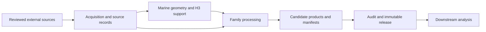

# Seascape concepts

The toolkit represents physical geography and mapped source evidence on explicit marine spatial support. Seven implementation families each own a different mechanism; [the architecture reference](../ARCHITECTURE.md) maps them to package modules.

The arrows describe the conceptual path. Individual stages and source requirements are listed in [stage inputs](../stage-inputs.md); the diagram is not an execution plan.

## The seven families

| Family | What it means | Essential distinction |
| --- | --- | --- |
| [Spatial support](https://github.com/MarineCast/toolkit-seascape/blob/main/src/seascape/spatial_support/README.md) | Water geometry, H3 identity, graph and neighborhoods | Full cell, clipped water, and model-area supports differ. |
| [Seafloor physiography](https://github.com/MarineCast/toolkit-seascape/blob/main/src/seascape/seafloor_physiography/README.md) | GEBCO bathymetry, terrain derivatives, geomorphic units | Terrain classes are physical descriptions, not habitat presence. |
| [Benthic substrate](https://github.com/MarineCast/toolkit-seascape/blob/main/src/seascape/benthic_substrate/README.md) | Modeled rock presence and sediment texture | Interpolated source surfaces are not direct survey observations. |
| [Coastal configuration](https://github.com/MarineCast/toolkit-seascape/blob/main/src/seascape/coastal_configuration/README.md) | Shoreline proximity and character, geometric fetch, waterbody shape | Fetch is geometry, not modeled wind or waves. |
| [Hydrologic connectivity](https://github.com/MarineCast/toolkit-seascape/blob/main/src/seascape/hydrologic_connectivity/README.md) | Freshwater sources, barriers, estuaries and water paths | Disconnected water-network distances remain null. |
| [Biogenic habitat](https://github.com/MarineCast/toolkit-seascape/blob/main/src/seascape/biogenic_habitat/README.md) | Mapped seagrass, kelp, reef and composite evidence | Unknown coverage is not ecological absence. |
| [Anthropogenic](https://github.com/MarineCast/toolkit-seascape/blob/main/src/seascape/anthropogenic/README.md) | Mapped built structures and coastal modification | Inventory absence does not prove no structure exists. |

## Grain, support, and interpretation

The canonical H3 model-area keys are `(H3_INDEX, H3_RESOLUTION)`. R8 support contains cells with nonzero water overlap; R6 is the parent union of R8 cells. Some products have a different grain, such as selected outlet or mapped object relationships. Never join those tables by row order or collapse them into one value per H3 cell without a deliberate aggregation rule.

Static source snapshots carry source vintage and acquisition/build provenance. A null may mean unavailable coverage, inapplicability, or disconnected graph support; inspect each field's QC, status, and denominator. A measured zero is different. [Scientific contracts](../CONTRACTS.md) and [structural variables](../structural-variables.md) give the precise rules.
