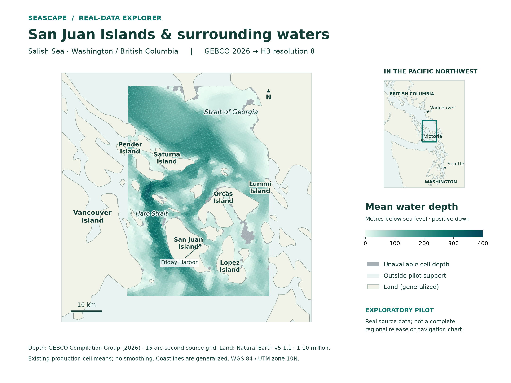

# Examples and workflows

Explore the [San Juan bathymetry atlas](san-juan-bathymetry.md): a high-resolution
static snapshot of real depth values, detailed R8 cells and an R6 comparison inset.

Use [Read and verify a bathymetry result](read-bathymetry.md) for a complete
offline walkthrough: generate a result, verify its checksum and H3 identities,
then interpret known depth and missingness controls.

Choose a path that matches the evidence you have. The first path is fully offline; the other two require reviewed source inputs or an existing release.

| Path | Start here | Result and limit |
| --- | --- | --- |
| 1. Offline first result | [Quick start](../getting-started/quick-start.md) and [demo details](../demo.md) | Synthetic bathymetry Parquet, manifest, report, figures; validates a small transform, not a region. |
| 2. Bounded real-data candidate | [Preparation and processing](../WORKFLOWS.md#bounded-real-data-processing), [configuration](../CONFIGURATION.md), [San Juan pilot](../pilots/san-juan.md) | A candidate based on reviewed local inputs; preflight and exploratory pilot results are not blanket release approval. |
| 3. Existing audited release | [Freeze and read a release](../API.md#freeze-and-read-a-release), [metric matrix](../metric-matrix.md) | Exact release/product/resolution artifact and optional H3 export, with source nulls and QC preserved. |

The [validation notebook](https://github.com/MarineCast/toolkit-seascape/blob/main/notebooks/README.md) is an optional readable client of the offline demo. It calls production APIs and is separate from the [San Juan live explorer](../pilots/san-juan.md), which has explicit acquisition and exploratory support. Examples requiring real inventories intentionally use configured paths and source review rather than pretending a public dataset is bundled.

## Bounded San Juan illustration

The [San Juan pilot](../pilots/san-juan.md) documents two bounded, cached-input bathymetry/support runs and their acceptance limits. The map is geographic context for that family result; it is not produced by the synthetic quick start. See [map sources and reproduction](../readme-map.md) for attribution and rendering details.
