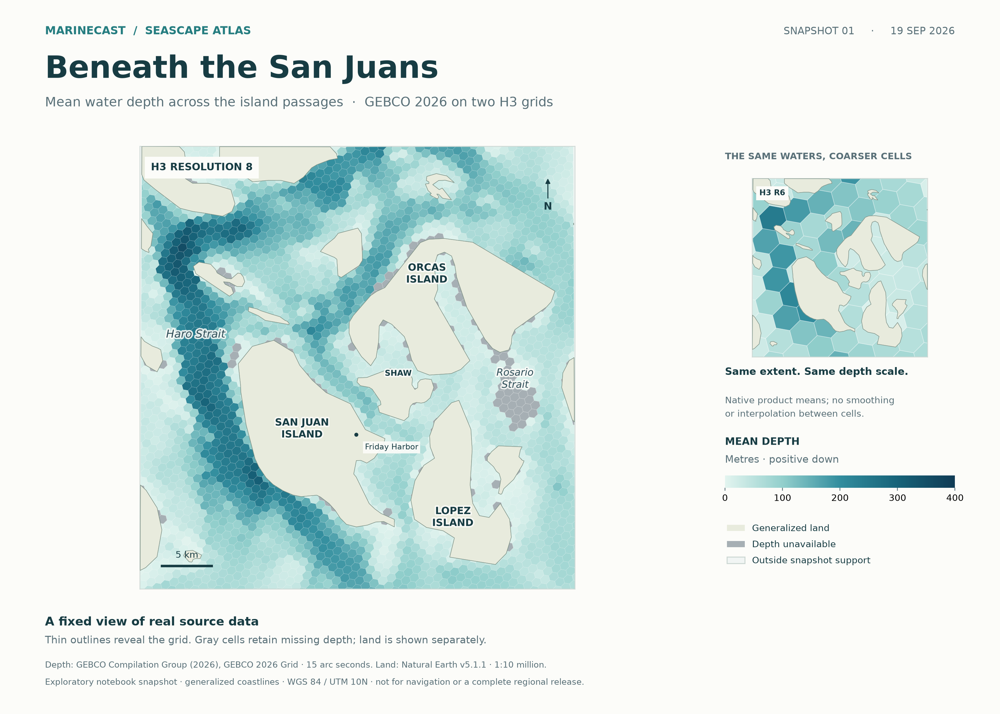

---
hide:
  - navigation
  - toc
---

# San Juan bathymetry atlas

A fixed view beneath the islands: real GEBCO depth values on water-clipped H3
grids. The detailed R8 map and coarser R6 inset share one extent and depth scale.

[](../assets/san-juan-snapshot.png)

[Open full-resolution PNG](../assets/san-juan-snapshot.png){ .md-button .md-button--primary }
[Download print PDF](../assets/san-juan-snapshot.pdf){ .md-button }

## Read the map

Darker cells show deeper mean water depth. The fine grid reveals variation
through Haro Strait and the surrounding island passages; the inset shows the
same area in larger cells. Each color is an existing product's cell mean.
Rendering adds no smoothing, interpolation or replacement of missing values.
Cells at the map edge are visually clipped; their values are not recomputed.

Gray means **depth unavailable**, not zero or dry land. Pale land comes from a
generalized coastline, so small islands and narrow channels may be simplified.
The 5 km scale bar uses the map's UTM projection. Place labels are editorial
orientation aids, not an authoritative gazetteer.

| Displayed support | H3 R8 · main map | H3 R6 · inset |
| --- | ---: | ---: |
| Cells intersecting this view | 2,562 | 80 |
| Cells with mean depth | 2,420 | 79 |
| Cells retaining null depth | 142 | 1 |
| Available cell means | 1–354 m | 10.70–243.43 m |

Counts describe the displayed crop, not the full source grid or surveyed area.
R6 and R8 are distinct sampling supports; the inset is not a resampled image of
the main map.

## A snapshot, with its provenance intact

The tables were produced on **September 19, 2026**, in the exploratory San Juan
notebook workspace. This illustration was exported on October 4, 2026. It freezes
those historical outputs; it does not claim a current-method rebuild, a complete
audited regional release, or independent scientific validation. The source raster,
products, upstream references and geometry identities were checked before rendering.
The later pilot's temporary products were not substituted.

Depth: GEBCO Compilation Group (2026), GEBCO 2026 Grid,
DOI [10.5285/4f68d5c7-45eb-f999-e063-7086abc036fa](https://doi.org/10.5285/4f68d5c7-45eb-f999-e063-7086abc036fa).
Its 15 arc-second grid spacing does not establish uniform survey resolution or
accuracy. The cached raster records elevation relative to sea level; output means
are metres positive down. Display projection: WGS 84 / UTM zone 10N.

Land: Natural Earth v5.1.1 at 1:10 million cartographic scale. Both providers place
these data in the public domain; source acknowledgement and provider terms apply.
See [GEBCO terms](https://www.gebco.net/data-products/gridded-bathymetry/terms-of-use)
and [Natural Earth terms](https://www.naturalearthdata.com/about/terms-of-use/).
The historical manifest's older license label has not been rewritten.
**Not for navigation.** No provider endorsement is implied.

??? details "Reproduce this exact export"

    The [renderer](../../scripts/render_san_juan_snapshot.py) requires the retained
    notebook workspace and extracted Natural Earth cache. It refuses different
    product or geometry identities, verifies manifest checksums, and joins by
    unique `H3_INDEX`. Missing inputs fail; there is no download fallback.

    From the checkout with the Seascape runtime installed:

    ```sh
    MPLCONFIGDIR=/tmp/seascape-map-mpl python scripts/render_san_juan_snapshot.py \
      --workspace notebooks/outputs \
      --land notebooks/outputs/data/raw/natural_earth/ne_10m_land/ne_10m_land.shp \
      --output docs/assets/san-juan-snapshot.png
    ```

    Outputs are the PNG, print PDF and adjacent
    [identity record](../assets/san-juan-snapshot.json). The record stores source
    and output checksums, crop, projection, scale and missingness counts.
    Cached scientific inputs are not bundled with this page. Rendering leaves
    their values and historical manifests unchanged.

For a runnable example without regional inputs, use
[Read and verify a bathymetry result](read-bathymetry.md). For broader source
context and subsequent validation, see the [San Juan pilot](../pilots/san-juan.md).
