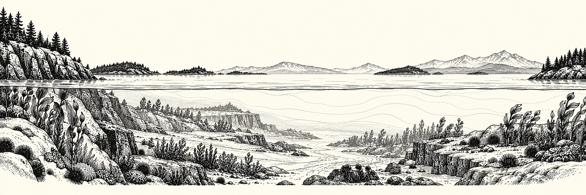

# Seascape Toolkit

Reproducible geospatial tools for describing the <strong>physical shape, composition, and connectivity</strong> of marine environments.

Seascape Toolkit turns reviewed source datasets into spatial features with explicit support, provenance, and missingness. Researchers and downstream applications can use those features for ecological analysis and modeling, while keeping source evidence separate from ecological conclusions.

!!! important "Interpretation boundary"
    A depth, shoreline, or mapped habitat feature is not species occurrence, habitat suitability, or a forecast. The package includes software and an offline synthetic demo; it does not bundle regional source data or a certified regional release.

-   **Get a first result**

    Install from source and run a small bathymetry demo without downloads or credentials.

    [Installation](getting-started/installation.md) · [Quick start](getting-started/quick-start.md)

-   **Find a variable**

    Browse the checked-in field catalog and the newer optional structural products, with their different validation states.

    [Variable catalog](variables/index.md)

-   **Understand the method**

    Trace spatial support, source grids and inventories, derived features, and release manifests.

    [Concepts](concepts/index.md) · [Processing](methodology/index.md)

-   **Use an existing release**

    Discover exact resolutions and checksum-verified products through the supported Python facade.

    [API overview](api/index.md)

## What the toolkit describes

| Physical or mapped theme | Examples in the implementation |
| --- | --- |
| Seafloor shape | GEBCO depth statistics, terrain derivatives, geomorphic units |
| Seafloor composition | Modeled rock presence and sediment texture, with evidence fields |
| Coastal form | Shoreline character, distances, geometric fetch, width and enclosure |
| Freshwater connections | Mapped outlets, barriers, estuarine and water-network relationships |
| Mapped habitat structure | Seagrass, kelp, reef and composite evidence with coverage states |
| Built environment | Mapped coastal modification and structures |
| Spatial support | Water geometry, H3 cells and passable water-network relationships |

See the [catalog guide](variables/index.md) for exact field names and the [capability coverage](capability-coverage.md) for unavailable or deferred work. Source rights and measurement support vary by family.

## Three ways to use it

1. **Try the offline demo** to inspect a production bathymetry transform on a deliberately synthetic fixture.
2. **Prepare a bounded real-data candidate** after reviewing inputs, source rights, and processing settings.
3. **Read an audited release** by exact release ID, product, and resolution for reproducible downstream use.

[Choose a workflow](examples/index.md) · [View the source repository](https://github.com/MarineCast/toolkit-seascape)
